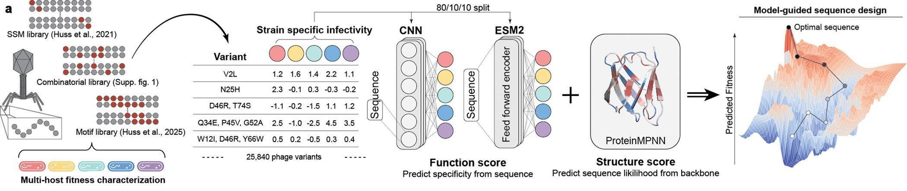

# Multiobjective learning and design of bacteriophage specificity

This repository contains the modeling and sequence-design code accompanying the Cell Systems manuscript:

> Novy N., Huss P., Evert S., Romero P. A., and Raman S. Multiobjective learning and design of bacteriophage specificity. Cell Systems, forthcoming. Preprint: https://doi.org/10.1101/2025.05.19.654895

The code trains multitask protein sequence-function models for the T7 bacteriophage receptor-binding protein (RBP) and uses those models to design variants with user-specified host-targeting objectives. The same workflow can be adapted to other protein engineering datasets where sequences are measured against multiple functions, hosts, substrates, or conditions.



Panel a of Figure 1 from the paper, showing the model-guided design workflow for T7 RBP sequence-function modeling and multiobjective design. Source: [PMC12139953](https://pmc.ncbi.nlm.nih.gov/articles/PMC12139953/figure/F1/).

## What This Work Did

The study used high-throughput sequence-function measurements of T7 RBP variants across five Escherichia coli host contexts to learn a multifunctional phage host-targeting landscape. The paper reports a combined dataset of 26,838 RBP variants and approximately 125,000 host-fitness measurements.

Using these data, the workflow in this repository supports:

- training multi-output CNN and ESM2-based predictors of strain-specific phage fitness;
- building ensembles from independent train/validation splits;
- predicting fitness for existing or newly proposed RBP sequences;
- optimizing sequences with simulated annealing for infectivity, specificity, or generality objectives;
- optionally incorporating ProteinMPNN scores as a structure-aware constraint during sequence design;
- filtering, ranking, and clustering designed sequences for downstream experimental characterization.

In the paper, trained models were used to design synthetic phages for 26 objectives: five single-host infectivity objectives, 20 host-specificity objectives, and one generalist objective. Designed phages were experimentally characterized to test whether model-guided multiobjective design could generate phages with enhanced infectivity, predefined specificity, and broader activity on unseen hosts.

## Repository Contents

```text
.
|-- code/
|   |-- train.py                 # Train sequence-function models
|   |-- predict.py               # Predict with a trained model or ensemble
|   |-- multiobjective_SA.py     # Simulated annealing sequence design
|   |-- combine_SA_outputs.py    # Merge, rank, filter, and cluster SA outputs
|   |-- splits.py                # Reproducible train/validation/test splits
|   |-- prep_grid_cmds.py        # Generate training command batches
|   |-- prep_SA_cmds.py          # Generate simulated annealing command batches
|   `-- ...
|-- data/
|   |-- datasets.yml             # Dataset registry consumed by the code
|   |-- T7RBD_all_separate/      # Training table, structures, weights, splits
|   |-- all_counts.csv.tar.bz2   # Raw count table from pooled phage assays
|   |-- designed_phage_scores.*  # Precomputed scores for designed phages
|   `-- pca-19_raw.csv           # Amino-acid feature table used by encodings
|-- training_args/
|   |-- T7_CNN_ensemble.txt      # CNN training configuration
|   `-- T7_ESM_ensemble.txt      # ESM-based training configuration
`-- example_commands/
    |-- make_splits_all.txt
    |-- cnn_ensemble_cmds.txt
    |-- make_ESM_ensemble.txt
    `-- sa_cmds.txt
```

The main indexed dataset is `T7RBD_all_separate`, defined in `data/datasets.yml`. It points to `data/T7RBD_all_separate/all_separate_outputs.pkl`, the wild-type RBP sequence, and the T7 RBP structure used by optional structure-aware design steps.

## Installation

No pinned environment file is currently included. A typical local setup is:

```bash
python3 -m venv .venv
source .venv/bin/activate
python -m pip install --upgrade pip
```

Install the core Python packages:

```bash
pip install \
  torch pytorch-lightning wandb \
  pandas numpy scipy seaborn matplotlib \
  scikit-learn scikit-learn-extra \
  pyyaml shortuuid openpyxl
```

Install optional packages for ESM models, hyperparameter searches, and related workflows:

```bash
pip install fair-esm torchtext omegaconf optuna joblib
```

Notes:

- Install PyTorch using the command appropriate for your CPU/GPU platform if the default `pip install torch` is not suitable.
- Weights & Biases logging runs offline unless `--wandb_online` is provided.
- ProteinMPNN-constrained design requires ProteinMPNN weights at `data/pre_trained_models/Protein_MPNN_v_48_010.pt`; these weights are not bundled in this repository.
- Model checkpoints from the paper are not bundled here. To run prediction or design, train new ensembles or place compatible checkpoints under the expected output directories.

## T7 RBP Workflow

The repository includes split files for the T7 RBP dataset under `data/T7RBD_all_separate/splits/`. To regenerate splits in a clean copy of the data directory:

```bash
bash example_commands/make_splits_all.txt
```

To train one CNN ensemble member:

```bash
python3 code/train.py \
  --split_dir data/T7RBD_all_separate/splits/ensemble_tr0.8_tu0.1_te0.1_r1 \
  @training_args/T7_CNN_ensemble.txt
```

To train one ESM-based ensemble member:

```bash
python3 code/train.py \
  --split_dir data/T7RBD_all_separate/splits/ensemble_tr0.8_tu0.1_te0.1_r1 \
  @training_args/T7_ESM_ensemble.txt
```

Command lists for larger ensemble runs are provided in:

- `example_commands/cnn_ensemble_cmds.txt`
- `example_commands/make_ESM_ensemble.txt`

Training outputs are written as:

```text
<log_dir_base>/<model_uuid>/version_<n>/
|-- args.txt
|-- metrics.csv
`-- checkpoints/
```

The saved `args.txt` file is important: prediction and design commands reuse it to reconstruct the exact model and data configuration.

## Predicting Fitness

Predict from a single trained model:

```bash
python3 code/predict.py \
  --log_dir output/ensembles/T7_ESM_35_ensemble_40/<model_uuid>/version_0 \
  --sequence_filename data/T7RBD_all_separate/all_separate_outputs.pkl \
  --output_filename output/predictions_single
```

Predict from an ensemble by taking a selected ensemble percentile, typically the median:

```bash
python3 code/predict.py \
  --ensemble_log_dir output/ensembles/T7_ESM_35_ensemble_40 \
  --sequence_filename data/T7RBD_all_separate/all_separate_outputs.pkl \
  --output_filename output/predictions_ensemble \
  --ensemble_monitor_percentiles 50
```

Prediction outputs are saved as pickle files. Input sequence tables should contain a `Sequence` column unless the command configuration specifies a different mutation/sequence column.

## Designing Sequences

`code/multiobjective_SA.py` uses trained ensembles to optimize RBP sequences by simulated annealing. Objectives are encoded with a string over the model outputs:

- `1` means maximize the output;
- `0` means minimize the output;
- `x` means ignore the output.

For the supplied T7 workflow, the design objectives are interpreted over the five host-fitness outputs after dataset-specific measurements are merged. The script prints the exact objective-column order at runtime. In the paper workflow, these correspond to the five assayed hosts: 10G, BL21, BW2/BW25113, rfaD deletion, and rfaG deletion.

Example: optimize five 12-mutant sequences for high activity on the first host while ignoring the other four outputs:

```bash
python3 code/multiobjective_SA.py \
  --strict_num_mut \
  --checkpoint_base_dir output/ensembles/T7_ESM_35_ensemble_40 \
  --outputs_to_maximize 1xxxx \
  --num_designs 5 \
  --num_muts 12 \
  --num_steps 20000 \
  --fitness_fxn gap \
  --seed 500 \
  --output_directory T7_ESM_designs \
  @output/ensembles/T7_ESM_35_ensemble_40/<model_uuid>/version_0/args.txt
```

Common objective examples:

```text
1xxxx   maximize host 1 only
x1xxx   maximize host 2 only
11111   maximize all five hosts, producing a generalist objective
10xxx   maximize host 1 while minimizing host 2
11x00   maximize hosts 1 and 2 while minimizing hosts 4 and 5
```

SA outputs are written to:

```text
SA_outputs/<output_directory>/<outputs_to_maximize>/
```

Each output row includes the designed sequence, mutations relative to wild type, mutational distance, design objective, ensemble statistics, and predicted host-fitness values.

## Filtering And Clustering Designs

After generating many simulated annealing outputs, combine and select candidate sequences:

```bash
python3 code/combine_SA_outputs.py \
  --dir "SA_outputs/T7_ESM_designs/*" \
  --desired_outputs 5 \
  --min_percentile 50 \
  --should_cluster \
  --endpoints_only
```

This script removes duplicates, filters by mutation distance and objective-score percentile, optionally keeps only endpoint sequences, and can select diverse candidates using k-medoids clustering over sequence distance and objective score.

## Using The Code On A New Protein Dataset

To adapt the framework:

1. Create a sequence-function table in `.csv`, `.tsv`, `.xlsx`, or `.pkl` format. Include full protein sequences in a `Sequence` column and one or more numeric target columns, such as condition-specific fitness scores.
2. Add the dataset to `data/datasets.yml` with `ds_name`, `ds_dir`, `ds_fn`, `wt_aa`, and optionally `pdb_path` if using ProteinMPNN.
3. Create train/validation/test split files with `code/splits.py`.
4. Create a training argument file modeled on `training_args/T7_CNN_ensemble.txt` or `training_args/T7_ESM_ensemble.txt`. Set `--target_names`, `--output_col_names`, `--mut_col_name`, `--encoding`, and architecture/loss options for the new task.
5. Train one or more models with `code/train.py`.
6. Use `code/predict.py` for inference or `code/multiobjective_SA.py` for sequence optimization.

The multiobjective design step is most useful when the model has learned several outputs for the same sequence, such as activity against multiple hosts, activity and specificity, activity and stability, or substrate preferences across related ligands.

## Reproducibility Notes

- Split files determine which variants are used for training, validation, and testing.
- Training and design arguments are saved with each run.
- The simulated annealing seed is controlled with `--seed`.
- PyTorch/GPU runs may still show small nondeterministic differences unless additional deterministic settings are applied.
- The example command files are command lists for batch execution; they can be run directly with `bash` or adapted for an HPC scheduler.

## Citation

If you use this code or data, please cite the Cell Systems article when available. Until then, cite the preprint:

```bibtex
@article{novy2025multiobjective,
  title = {Multiobjective learning and design of bacteriophage specificity},
  author = {Novy, Nathan and Huss, Phil and Evert, Sarah and Romero, Philip A. and Raman, Srivatsan},
  journal = {bioRxiv},
  year = {2025},
  doi = {10.1101/2025.05.19.654895}
}
```

## License

A license file is not currently included. Add a license before public release to define permitted reuse.
